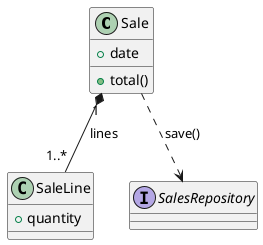

## Purpose

Create UML class diagrams in PlantUML to model static structure: classifiers, members, and relationships. Keep the diagram aligned with domain language and readable for analysis/design.

## Required inputs

- Domain concepts to model (entities, roles, services, rules)
- Candidate attributes and operations per classifier
- Relationship semantics (inheritance, composition, dependency, multiplicities, roles)
- Collaboration context between objects (visibility, temporality, versatility)

## Mandatory workflow (Driver/Navigator)

1. List classifiers and choose the correct type (class, interface, enum, etc.)
2. Define members (attributes/operations) and visibility when relevant
3. Add structural relationships with the correct connectors
4. Decorate relationships with multiplicities, roles, and direction
5. Run a final readability pass (remove noise, keep domain terminology)

## Execution rules (MUST / MUST NOT)

- MUST use PlantUML class diagram syntax
- MUST choose the correct classifier keyword for each concept
- MUST use relationship types that match meaning (inheritance is not dependency)
- MUST choose relationships using collaboration context: visibility, temporality, and versatility
- MUST keep names and labels in domain language
- MUST add multiplicities when cardinality is relevant
- MUST NOT force layout as the primary objective (PlantUML autolayout first)
- MUST NOT add implementation detail (SQL, internal framework concerns) at analysis level
- MUST NOT overload the diagram with unnecessary members or decorative relationships

## Classifier syntax

Use these declarations when applicable:

```plantuml
allow_mixing

class ClassName
class LongClass as "Class with long\nname or spaces"
abstract class AbstractClass
interface InterfaceType
enum EnumType
annotation AnnotationType
entity EntityType
boundary Boundary
control Control
```

## Member syntax

Use class blocks for attributes and operations.

```plantuml
class ClassName {
	type attribute
	untypedAttribute
	{static} staticAttribute

	- privateAttribute
	# protectedAttribute
	~ packageAttribute
	+ publicAttribute

	returnType method(paramType parameter) Exception
	{static} staticMethod()
	{abstract} abstractMethod()

	- privateMethod()
	# protectedMethod()
	~ packageMethod()
	+ publicMethod()
}
```

Visibility markers:

- `+` public
- `-` private
- `#` protected
- `~` package

## Relationship syntax

Use connector semantics intentionally:

- Generalization: `Base <|- Derived`
- Realization: `Base <|. Implementation`
- Composition: `Whole *-- Part`
- Aggregation: `Whole o-- Part`
- Association: `ClassA -- ClassB`
- Dependency/usage: `ClassA ..> ClassB`

Direction hints to improve readability:

- `-up-`, `-down-`, `-left-`, `-right-`

Multiplicities and role:

```plantuml
Source "1..*" -right-> "7" Target : role >
```

Association-class style (when needed):

```plantuml
class Buyer
class Seller
class Purchase

Buyer "0..*" -- "1..*" Seller
(Buyer, Seller) .. Purchase
```

## Relationship selection guide

### 1) Decide relationship family first

- Collaboration relationships: composition/aggregation, association, dependency
- Transmission relationships: generalization/realization

Use transmission only when you truly model a type hierarchy (`is-a`) or a contract implementation.

### 2) Collaboration criteria

Evaluate these three criteria in the specific context:

- Visibility: is the collaboration private to one object, or public/shared with others?
- Temporality: is collaboration long-lived or momentary?
- Versatility: is collaborator interchangeable (many possible providers) or fixed/specific?

Context is decisive. There is no universal categorical choice for every domain.

### 3) Decision matrix for collaboration

| Relationship | Choose it when... | Typical signals | PlantUML |
| --- | --- | --- | --- |
| Composition | It is a strong whole-part ownership relation | Private visibility, high temporality, low versatility; part lifecycle tied to whole; parts not shared | `Whole *-- Part` |
| Aggregation | It is a weak whole-part relation | Public visibility, high/medium temporality, low versatility; part can outlive whole; parts can be shared | `Whole o-- Part` |
| Association | A client keeps a stable link to a specific server over time | Public visibility, high/medium temporality, low versatility; repeated use of same collaborator | `Client -- Server` |
| Dependency/Usage | A client uses any server momentarily | Public/private visibility, low temporality, high versatility; parameter/local-variable collaboration | `Client ..> Server` |

### 4) Decision matrix for transmission

| Relationship | Choose it when... | PlantUML |
| --- | --- | --- |
| Generalization | Subtype preserves and specializes base behavior (polymorphic substitution expected) | `Base <|- Derived` |
| Realization | A concrete type implements an interface/contract | `Contract <|. Implementation` |

Avoid these inheritance mistakes:

- Inheritance by limitation: subclass cannot support full base behavior
- Inheritance by construction: relation is actually composition, not inheritance

### 5) Practical selection order

1. Ask `is-a` or `implements` first. If yes, use generalization/realization
2. If not, ask `whole-part`
3. If whole-part: choose composition vs aggregation by lifecycle and sharing
4. If not whole-part: choose association vs dependency by duration and collaborator interchangeability

## Output contract

The generated output MUST include:

- One PlantUML block with `@startuml` and `@enduml`
- Correct classifier declarations
- Members only when they add modeling value
- Relationships with correct semantics
- Multiplicities/roles only when meaningful

## Minimal template



## Validation checklist

1. Are classifier types correctly chosen?
2. Are visibility/static/abstract markers used correctly?
3. Does each relationship express the intended meaning?
4. Are multiplicities and roles consistent with domain rules?
5. Was relationship choice justified by visibility, temporality, and versatility?
6. Are inheritance links real transmission (`is-a`/`implements`) and not disguised composition?
7. Is the diagram readable without layout micromanagement?
8. Was implementation noise avoided?