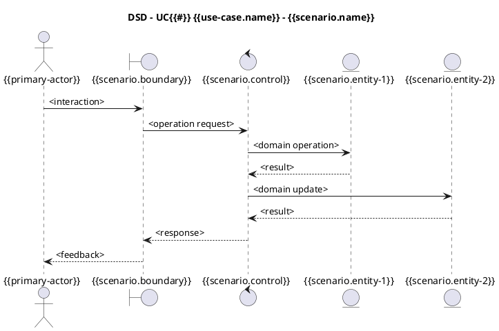

# Use Case Realization - UC{{#}} {{use-case.name}}

> [!info]
> A Use Case Realization describe the design of one or more **scenarios** of a use case, each of these is a scenario realization.

## Revision History

| Version | Date | Description | Author |
| :--- | :--- | :--- | :--- |
| Iteration draft | {{date}} | First draft for use case realization mapping. | {{author}} |
| | | | |

---

## Goal

<Describe how this realization materializes the functional requirements of UC{{#}} {{use-case.name}} into object design.>

## Inputs and References

- [Use Case](../../02%20Requirements/use-cases/UC{{#}}%20{{use-case.name}}.md)
- [System Sequence Diagrams](../../02%20Requirements/SSDs/SSD%20UC{{#}}%20{{use-case.name}}.md)
- [Operation Contracts](../../02%20Requirements/SOperation%20Contracts/UC{{#}}%20{{use-case.name}}%20-%20Operation%20Contracts.md)
- [Supplementary Specification constraints](../../02%20Requirements/supplementary-specification.md)
- [Glossary](../../02%20Requirements/glosary.md)
- [Domain Model](../../01%20Business%20Modeling/Domain%20Model.md)

## Scenario Mapping

| Use Case Steps | Scenario | SSD Reference | Operation Contract(s) | Key Postconditions | Supplementary and Glossary Notes | Status |
| :--- | :--- | :--- | :--- | :--- | :--- | :--- |
| <e.g., 1-8> | S1 - <scenario name> | <SSD link or id> | <CO1, CO2> | <main postconditions> | <constraints and terms> | <draft/reviewed/approved> |
| <e.g., step 2a.> | S2 - <scenario name> | <...> | <...> | <...> | <...> | <...> |
| ... | ... | ... | ... | ... | ... | ... |

## Scenario Realizations

{for scenario in scenarios}
### Scenario S{{scenario.#}}: {{scenario.name}}

#### Requirement Traceability

- Use case steps: `{{scenario.use-case-steps}}`
- SSD: `{{scenario.ssd-reference}}`
- Operation contracts: `{{scenario.operation-contracts}}`

#### Design Sequence Diagram



#### Design Class Diagram (Scenario Slice)

```plantuml
@startuml
title DCD Slice - UC{{#}} {{use-case.name}} - {{scenario.name}}

class {{scenario.boundary}} <<boundary>>
class {{scenario.control}} <<control>>
class {{scenario.entity-1}} <<entity>>
class {{scenario.entity-2}} <<entity>>

{{scenario.boundary}} --> {{scenario.control}} : delegates
{{scenario.control}} --> {{scenario.entity-1}} : uses
{{scenario.control}} --> {{scenario.entity-2}} : updates

@enduml
```

#### Operation Contract Postcondition Satisfaction

- [ ] `{{scenario.contract-1}}` postcondition 1 satisfied by `<message or class responsibility>`
- [ ] `{{scenario.contract-1}}` postcondition 2 satisfied by `<message or class responsibility>`
- [ ] `{{scenario.contract-2}}` postcondition 1 satisfied by `<message or class responsibility>`

#### Supplementary Specification and Glossary Alignment

- Constraints applied: `<security/performance/audit/validation constraints>`
- Glossary terms used: `<term 1, term 2, term 3>`
- Naming rationale from business modeling: `<domain concept to software object name rationale>`

{end scenario}

## Consolidated Design Class View (Use Case Level)

```plantuml
@startuml
title Consolidated DCD - UC{{#}} {{use-case.name}}

package "UI" {
	class <BoundaryA> <<boundary>>
}

package "Application" {
	class <ControllerA> <<control>>
}

package "Domain" {
	class <EntityA> <<entity>>
	class <EntityB> <<entity>>
}

<BoundaryA> --> <ControllerA>
<ControllerA> --> <EntityA>
<ControllerA> --> <EntityB>
<EntityA> "1" -- "0..*" <EntityB>

@enduml
```

## Validation Checklist

- [ ] One document for this use case, containing all mapped scenarios
- [ ] Each scenario has Use Case -> SSD -> Operation Contract traceability
- [ ] Each scenario includes a design sequence diagram
- [ ] Class design is explicit per scenario and/or consolidated
- [ ] Postconditions are explicitly satisfied
- [ ] Supplementary constraints are reflected
- [ ] Glossary terminology is consistent
- [ ] Path and naming match OpenSpec convention
