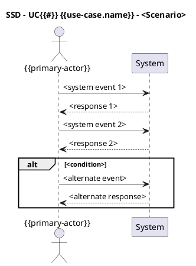

# System Sequence Diagram - UC{{#}} {{use-case.name}}

[Use Case](../use-cases/UC{{#}}%20{{use-case.name}}.md)

## Scenario

- Use case: `UC{{#}} {{use-case.name}}`
- Scenario: `<Main Success Scenario | Extension X>`

## Traceability

- Scenario step(s): `<list of step numbers>`
- Notes: `<constraints, validations, timing assumptions>`
